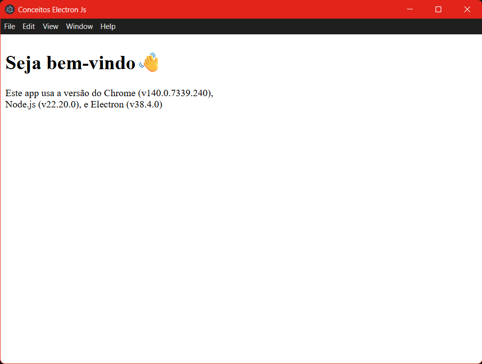

# estudo_base_electronjs

Projeto de estudos com Electron.js, explorando os conceitos gerais e principais do **Electron.js** como aplicação Desktop.

---

## Fonte de estudo e pesquisa

* Leitura da documentação original
> [Documentação Original Electron js](https://www.electronjs.org/pt/docs/latest/tutorial/examples)

* Vídeos no YouTube e Sites com artigos (Wiki, Blogs, etc.)

> [Vídeo aula criando um projeto em Electron.js com Javascript](https://youtu.be/ML743nrkMHw?si=cKAvXkqOYWPR_8kL)

> [Artigo sobre o framework Electron - Trybe](https://blog.betrybe.com/framework-de-programacao/electron/)

> [Wikipedia - Electron (software)](https://pt.wikipedia.org/wiki/Electron_%28software%29)

> [Introdução ao Electron - Tableless](https://tableless.com.br/introducao-ao-electron/)

> [Como criar um mini projeto com ElectronJS (com gráficos)](https://terminalroot.com.br/2023/11/como-criar-um-mini-projeto-com-electronjs.html)

---

## Script e Configuração

###  Passos para criar um projeto do zero

* Comece com o comando inicial para gerar o `package.json`

  ```bash
  npm init
  ```

* Instale o Electron

  ```bash
  npm install electron --save-dev
  ```

  > O `--save-dev` é comum para ambientes de desenvolvimento, pois o Electron é usado apenas na execução local, não em produção web.

* Crie a estrutura base do projeto:

  ```
  meu-projeto/
  ├── package.json
  ├── main.js
  └── index.html
  ```

---

### Caminho opcional para criar um projeto mais rápido

* Esse comando é um atalho para criar um projeto completo, com estrutura pronta, empacotador, scripts e dependências configuradas:

  ```bash
    npx create-electron-app meu-projeto
  ```

  > Ideal para iniciar um projeto profissional sem configurar tudo manualmente.

---

## Código base para rodar o projeto

#### No arquivo `main.js`

```js
import { app, BrowserWindow } from "electron";

const criarJanela = () => {
  const janela = new BrowserWindow({
    width: 800,
    height: 600,
    webPreferences: {
      nodeIntegration: true, // permite usar Node.js no front-end
      contextIsolation: false // caso precise para o desenvolvimento
    }
  });
  janela.loadFile('index.html');
};

app.whenReady().then(() => {
  criarJanela();
});
```
- **Detalhe:**  `contextIsolation` é uma configuração isola o contexto de execução do site (renderer) do contexto interno do Electron (Node.js, IPC, etc.). Ele impede que scripts que rodam dentro da página (como o JavaScript do seu index.html ou scripts injetados de terceiros) tenham acesso direto aos recursos internos do Node.js ou do Electron.
* Ao executar, abrirá uma janela automaticamente (em Windows, Linux e macOS).
* O `app` controla o **ciclo de vida da aplicação**.
* O `BrowserWindow` cria e gerencia as **janelas da aplicação desktop**.
* O `BrowserWindow` só pode ser criado **após o evento `ready`** do `app` ser disparado — por isso usamos `app.whenReady().then()`.

Execute no terminal `npm start` para rodar o projeto:
```json
"scripts": {
  "start": "electron ."
}
```
---

### Encerrar a aplicação quando todas as janelas forem fechadas

```js
app.on('window-all-closed', () => {
  if (process.platform !== 'darwin') app.quit();
});
```

* O macOS mantém os apps abertos mesmo sem janelas, por isso o `if`.
* `process.platform` retorna o sistema operacional atual (`win32`, `linux`, `darwin`...).

---

### Abrir uma janela se nenhuma estiver aberta (macOS)

```js
app.whenReady().then(() => {
  criarJanela();

  app.on('activate', () => {
    if (BrowserWindow.getAllWindows().length === 0) criarJanela();
  });
});
```

---

### Observações gerais

* `app.on()` → Escuta eventos do ciclo de vida do aplicativo, como `ready`, `activate`, `window-all-closed`, etc.
* `"activate"` → Evento disparado quando o usuário clica no ícone do app e não há janelas abertas (macOS).
* Separação do código de front-end (`index.html`, `renderer.js`) do código principal (`main.js`).
  O **processo principal** (`main.js`) controla janelas e sistema. Já o **processo de renderização** (`renderer.js`) lida com a interface e interações do usuário.
* Electron junta o **Chromium + Node.js**, então é possível usar recursos do navegador **e** do Node ao mesmo tempo.
* Caso o projeto use módulos ES (import/export), no `package.json` adicione:

  ```json
  {
    "type": "module"
  }
  ```
* **Por Segurança:** Evitar usar `nodeIntegration: true` em produção, pois isso permite execução de scripts maliciosos dentro do DOM.
  Prefira comunicação segura via **IPC (Inter-Process Communication)**.

  > **O que é IPC (Inter-Process Communication)?**
  > 
  > É o sistema que permite a comunicação entre o processo principal (´main´, que controla o app e tem acesso ao sistema) e os processos de renderização (`renderer`, que exibem a interface (HTML, CSS, JS))
  >
  > Ou seja, o meio pelo qual o front-end (renderer) envia e recebe mensagens do back-end (main) dentro do aplicativo Electron
---

## Termos e Funções Importantes

| Termo / Função                  | Descrição                                                                                 |
| ------------------------------- | ----------------------------------------------------------------------------------------- |
| `app`                           | Controla o ciclo de vida da aplicação Electron (inicialização, eventos, fechamento, etc.) |
| `BrowserWindow`                 | Cria e gerencia janelas da aplicação, permitindo carregar arquivos HTML ou URLs.          |
| `ipcMain`                       | Gerencia mensagens vindas do processo de renderização (`renderer`).                       |
| `ipcRenderer`                   | Envia mensagens do front-end para o processo principal (`main`).                          |
| `webContents`                   | Representa o conteúdo web renderizado dentro de uma `BrowserWindow`.                      |
| `Tray`                          | Cria ícones e menus na bandeja do sistema (tray bar).                                     |
| `Menu`                          | Cria menus personalizados na janela ou bandeja.                                           |
| `shell`                         | Permite abrir links e arquivos externos no sistema operacional.                           |
| `app.whenReady()`               | Retorna uma Promise resolvida quando o Electron terminou de inicializar.                  |
| `app.on('activate')`            | Evento disparado quando o aplicativo é ativado (especialmente no macOS).                  |
| `app.quit()`                    | Fecha a aplicação completamente.                                                          |
| `BrowserWindow.getAllWindows()` | Retorna todas as janelas atualmente abertas.                                              |

---


## Estruturas mais comuns de pastas
```
meu-projeto/
├── api/                     # Opcional: sua API (pode ser local ou externa)
│   ├── routes/
│   └── server.js
|
├── main/                # Processo principal (controla janelas, menus, sistema)
│   ├── main.js
│   ├── preload.js       # Script que faz ponte entre o main e o renderer (segurança)
│   ├── ipcHandlers.js   # Comunicação via IPC
│   └── menu.js          # Criação de menus personalizados
│
├── renderer(frontend)/            # Processo de renderização (interface e lógica de UI)
│   ├── index.html
│   ├── renderer.js
│   ├── src/
│   │   ├── App.jsx
│   │   ├── index.jsx
│   │   └── components/  # Componentes de interface (botões, janelas, modais, etc.)
│   ├── public/
│   └── package.json   
│
├── assets/    
│   ├── icon.png
│   └── logo.svg
│
├── package.json
|
└── build/               # Saída de build (quando empacotar com Electron Builder)
```

---
## Como o rederizador se comunica de forma segura com o processo principal?
>  Entendendo o IPC (Inter-Process Communication)

#### Arquivo de pré-carregamento (Preload Scrips)

- Arquivo é carregador no rederizador antes do html
- Servem para expor apenas o que você quer para o código do renderizador, sem dar acesso total ao Node.js a forma mais segura.
  
> ##### Exemplo do código
```js
import { contextBridge } from "electron";

contextBridge.exposeInMainWorld('versions', {
    node:() => process.versions.node,
    chrome:() => process.versions.chrome,
    electron:() => process.versions.electron,
})
```
###### observações:
- Usa o `contextBridge` para criar uma **variável global** chamada `versions` no renderizador.
- Essa variável só permite que leia as versões do Node, Chrome e Electron.
- Não dá **acesso completo ao Node.js**, o que é importante para segurança. 

#### Usando o preload script no BrowserWindow
Ao criar uma janela no Electron, conecta-se o preload


```js
const mainWindow = new BrowserWindow({
  width: 800,
  height: 600,
  webPreferences: {
    preload: path.join(__dirname, 'preload.js')
    // Caso use ES module como forma de importação de módulos, substitua o '__dirname' por 'process.cwd()'
  }
})
```
- `preload.js` é o script que vai rodar antes da página carregar.
- Ele injeta a variável `versions` no window da sua página.

> No HTML/JS pode-se colocar este trecho para teste.
```
console.log(window.versions.node())     // mostra a versão do Node
console.log(window.versions.chrome())   // versão do Chrome
console.log(window.versions.electron()) // versão do Electron
```

#### **Observações Gerais**

- Não deve dar acesso total ao `Node.js` no renderizador por segurança.
- O `preload script` permite criar um “meio-termo seguro”, onde expõe apenas o que quer do Node/Electron para o renderizador.

## Tela da Aplicação


---
## Comunicação entre processos (ipcMain -> ipcRenderer)
O processo principal (main) e o renderizador (Renderer) têm responsabilidades distintas e não são intercambiáveis, ou seja, não épossível acessar as APIs do Node.js diretamente do processo de renderização, nem o HTML (DOM) do processo principal.

A solução para essa comunicação entre processos (IPC), é usar elétrons `ipcMain` e `ipcRenderer`. Para enviar uma mensagem da sua página da web para o processo principal, pode configurar um manipulador de processo principal com `ipcMain.handle` e então exponha uma função que chama `ipcRenderer.invoke` para acionar o manipulador no script de `preload`.

```js
import { contextBridge, ipcRenderer } from "electron";

contextBridge.exposeInMainWorld('versions', {
    ping: () => ipcRenderer.invoke('ping') 
})
```

> **Observação Importante**
>
> Segurança IPC:
> - Não exponha todo o 'ipcRenderer' módulo via pré-carregamento para o código da interface. Em vez disso, exponha só funções específicas e controladas. Isso evita que códigos maliciosos dentro da UI mande qualquer mensagem ao processo principal.
  

Após a configuração do `ipcRender` deve-se configurar o `handle` no processo principal (Main), faz isto antes carregando o arquivo html para que o manipulador esteja garantido antes de enviar o `invoke` da chamada do renderizaor. 

```js
import { app, ipcMain } from "electron";

app.whenReady().then(() => {
  ipcMain.handle('ping', () => 'pong')
  createWindow()
})
```

Depois de configurar o remetente e o destinatário, pode enviar mensagens do renderizador para o processo principal por meio do 'ping' canal que foi definido.

```js
const exibirTexto = async () => {
    const response = await window.versions.ping()
    console.log(response)
    informacao.innerText = `Texto enviado pela Api/Main ${response}`
}

exibirTexto()

```

A mensagem será exibida na janela da aplicação.

## Conclusões sobre a comunicação geral e IPC

Como cada parte se comunica:

🔹 1. Main Process (main.js)
  - Roda em Node.js puro.
  - Controla janelas (`BrowserWindow`), menus, arquivos, etc.
  - NÃO acessa o DOM, nem React...
  - Pode chamar APIs externas usando `fetch` ou `axios`.

🔹 2. Renderer Process (React ou HTML)
  - É a **interface** (React, HTML e CSS).
  - NÃO tem acesso direto ao `fs`, `os`, etc. ( Isso por segurança).
  - Pode pedir para o `Main Process` fazer algo via `IPC`.

🔹 3. Preload (ponte segura)
  - Fica entre o `Main` e o `Renderer`.
  - Usa `contextBridge.exposeInMainWorld()` para expor funções seguras ao React.
  
#### Exemplo de um fluxo dessa comunicação (Cadastro de um produto)

Para o frontend usa-se react como exemplo:
```js
function App() {
  const enviarForm = async (e) => {
    e.preventDefault();
    const produto = { nome: "Caneta", preco: 2.50 };
    const resultado = await window.electronAPI.cadastrarProduto(produto);
    alert(resultado.mensagem);
  };

  return (
    <form onSubmit={enviarForm}>
      <input name="nome" placeholder="Nome" />
      <input name="preco" placeholder="Preço" />
      <button type="submit">Cadastrar Produto</button>
    </form>
  );
}
```
- O react chama o preload ao executar `window.electronAPI.cadastrarProduto(produto)`, Isso envia os dados via IPC para o main.js.

O `main` recebe esses dados via evento IPC e faz requisição na API

```js
import { app, BrowserWindow, ipcMain } from 'electron';
import axios from 'axios';

ipcMain.handle('cadastrar-produto', async (event, dados) => {
  try {
    const res = await axios.post('http://localhost:3000/api/produtos', dados);
    return { sucesso: true, mensagem: 'Produto cadastrado!' };
  } catch (erro) {
    return { sucesso: false, mensagem: 'Erro ao cadastrar.' };
  }
});
```
O Main retorna a resposta da API de volta ao Renderer.
O resultado ({sucesso: true, mensagem: 'Produto cadastrado!'}) volta para o React.

> Em geral, resumo da comunicação:
```
[ React (Renderer) ]
     ↓ (via preload)
[ IPC → Main Process (Electron) ]
     ↓ (HTTP request)
[ API Express (localhost:3000) ]
     ↑ (resposta JSON)
[ Main envia de volta via IPC ]
     ↑
[ Renderer exibe resultado ]
```
--- 

### Onde a Api entra?
Há duas opções para encaixar a API no projeto.

🔹 1° já existe uma API rodando fora do Electron (como um backend Node.js/Express).
  - O electron apenas consome a API
  - O Main Process faz as requisições HTTP (axios ou fetch).
  - A comunicação é feita pelo ipcMain ↔ ipcRenderer.
  
🔹 2° Uma API local (dentro do próprio Electron)
  - Sobe um servidor Express dentro do main.js, caso quisser tudo embutido.
  - Isso torna a aplicação mais pesado.
  - Para casos se quer que o app funcione totalmente offline.
  
**Detalhes importante!**:
> É possível fazer a requisição pelo React (Renderer), mas há pontos importante:
- Fazer pela interface expõe URLs, tokens e possíveis dados sensível.
- Isso burla o isolamento do Electron.
- Caso o app precise funcionar offline, o Main pode lidar com cache e filas, mas Renderer não.

## Ciclo de vida da aplicação com Electron
O ciclo de vida é definido quando o app inicia, executa e encerra. No Electron ele é controlado pelo `Main process` através do módulo `app`.
- O momento inicialização do ciclo é quando roda o `app.whenReady()`.
- A execução é quando app está em uso e há interação com as funcionalidades do app.
- O momento de encerramento é quando todas as janelas são fechadas o electron emite um evento. Há eventos que permitem interceptar o momento antes do app encerrar chamados `before-quit` e `will-quit`, eles podem salvar dados do usuário, fechar conexões com banco de dados e cancelar saídas indevidas.


## Mais detalhes sobre outros assuntos
Acesse os Readmes 
- [Estrutura de projetos mais comuns para o Main Process](aprofundando.md)